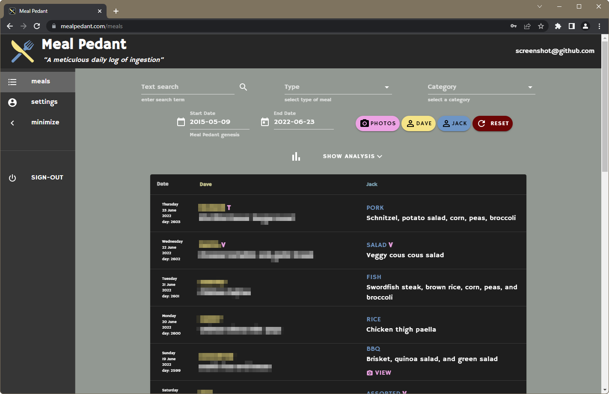

<p align="center">
	
</p>

<h1 align="center">Meal Pedant PWA site</h1>

<p align="center">
	The frontend for <a href='https://www.mealpedant.com' target='_blank' rel='noopener noreferrer'>mealpedant.com</a>,
	see the <a href='https://www.github.com/mrjackwills/mealpedant_api' target='_blank' rel='noopener noreferrer'>backend api source-code here.</a>
	<br>
	Invite to the service on request
</p>
<p align="center">
	Built using <a href='https://vuejs.org/' target='_blank' rel='noopener noreferrer'>vue.js</a>,
	with <a href='https://vuetifyjs.com/en/' target='_blank' rel='noopener noreferrer'>Vuetify</a>,
	in <a href='https://www.typescriptlang.org' target='_blank' rel='noopener noreferrer'>Typescript</a>
</p>

<hr>
<p align="center"><em>Since May 9th 2015, two transatlantic friends have pedantically exchanged information on every evening meal that they have consumed. This is a comprehensive chronicling of that pedantry.</em></p>
<p align="center">
	<a href="https://raw.githubusercontent.com/mrjackwills/mealpedant_vue/main/.github/screenshot.png" target='_blank' rel='noopener noreferrer'>
		
	</a>
</p>
<hr>

## Features

<ul>
	<li>PWA with Desktop & Mobile layout</li>
	<li>Brotli & Gzipped compressed output</li>
	<li>Weak password resolution & rejection, powered by <a href='https://haveibeenpwned.com/' target='_blank' rel='noopener noreferrer'>hibp</a></li>
	<li>IndexedDB storage, using <a href="https://dexie.org" target='_blank' rel='noopener noreferrer'>Dexie</a></li>
	<li><a href="https://pinia.vuejs.org/" target='_blank' rel='noopener noreferrer'>Pinia</a> for local data storage</li>
	<li>Client side routing with <a href="https://router.vuejs.org/" target='_blank' rel='noopener noreferrer'>Vue Router</a></li>
	<li>Form validation with <a href="https://vuelidate.js.org/" target='_blank' rel='noopener noreferrer'>Vuelidate</a></li>
	<li>QR code creation</li>
	<li>Github release workflow</li>
</ul>


## Todo
<ul>
	<li>Convert from Vue 2 to Vue 3</li>
	<li>Switch from webpack to Vite</li>
	<li>testing - zero tests so far :( </li>
	<li>Refactor duplicate code</li>
</ul>

## Required software

1) <a href='https://nodejs.org/en/' target='_blank' rel='noopener noreferrer'>Node.js</a> - runtime

File that are required by mealpedant
| file | reason|
|---|---|
|```./.env.development```	| development enviromental variables|
|```./.env.production```	| productions enviromental variables|

## Development

Use docker dev container (found in ./.devcontainer)

*or*

1) Install all required packages ```npm install```

2) Run locally ```npm run serve```

## Build step

```node build```
	
 or
 
 ```npm run build```